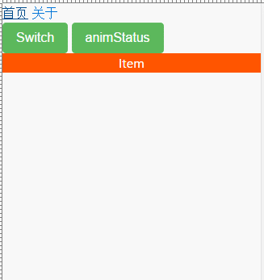

# 动画

Angular动画实现了一套能跟纯CSS动画性能相媲美的类库，而对于浏览器而言是基于原生 [Web Animations API](https://w3c.github.io/web-animations/) 接口实现的，所以如果有浏览器上兼容问题，还需要引入 [web-animations.min.js](https://github.com/web-animations/web-animations-js)。

总之，很牛B。

## 一、引入模块

动画模块**只允许导入一次**，所以最好在**根模块** `app.module.ts` 中导入它。

```typescript
import { BrowserAnimationsModule } from '@angular/platform-browser/animations';
@NgModule({
    imports: [ BrowserModule, BrowserAnimationsModule ]
});
```

然后可以组件导入相关动画常用类：

```typescript
import { trigger, style, transition, animate, group } from '@angular/animations';
```

## 二、使用动画

假定我们定义好一个动画后，是如何呈现的呢？很简单采用 `@` 加动画触发器名称。

```html
<div [@ant]="antStatus"></div>
```

表达式左边为 `[@ant]` 为动画触发器名称；右边绑定一个变量，这样我们可以通过组件类变更变量的值，从而实现切换不同动画状态。

```typescript
class TestComponent {
    antStatus: string = 'normal';

    toggle() {
        this.antStatus = this.antStatus ===  'normal' ? 'end' : 'normal';
    }
}
```

那么，我们是如何定义这个动画触发器的呢？

## 三、定义动画

`@Component` 装饰器有个 `animations` 动画属性，跟动画有关的都放在这里。

下面是一个简单的示例：

```typescript
@Component({
    animations: [
        trigger('ant', [
            state('normal', style({ transform: 'scale(1)' })),
            state('big', style({ transform: 'scale(2)' })),
            transition('normal => big', animate('500ms ease-in')),
            transition('big => *', animate('500ms ease-out')),
            transition(':enter', [
                style({ transform: 'translateX(-100%)' }),
                animate(500)
            ]),
            transition(':leave', [
                group([
                    animate('0.2s ease', style({
                        transform: 'translate(150px,25px)'
                    })),
                    animate('0.5s 0.2s ease', style({
                        opacity: 0
                    }))
                ])
            ])
        ])
    ]
})
```

Angular提供一套动画DSL，但为数并不多。利用 `trigger` 定义一个动画触发器，并为其取名：**itemAnim**。它接收的是一个数组，可以在数组内定义状态（`state`）、转场（`transition`）信息。

+ `state` 状态定义很简单，名称以及CSS样式对象。
+ `transition` 状态转场。

对于动画状态的定义，有多种类型：

+ `style` CSS样式对象。
+ `animate` 动画效果。
    + `keyframes` 定义 @keyframes 规则

当然，动画也是有执行顺序的：

+ `sequence` 按顺序执行动画。
+ `group` 按同步执行动画。
+ `stagger` 动画交错处理。

有时，希望整个动画里对某个元素增加额外的动画时：

+ `query` 指定某个状态下某个元素的动画状态。
+ `animateChild` 指当存在父子动画时，子动画会变无效，需要使用此属性强制触发。

### 转场

所谓转场是指从一种状态到另一种状态的过程，并且用 `=>` 来表示方向。比如，从 `normal` 状态到 `big` 状态。

```typescript
transition('normal => big');
```

**别名**

`transition` 转场提供了三个别名，使动画处理更便利。

+ `:enter` 进场时。
+ `:leave` 离场时。
+ `*` 任何状态。

## 四、路由动画

我想在移动端做路由转场动画一定非常酷吧，好在Angular4以后就内置了路由动画切换。

### 1、定义转场动画效果

```typescript
// router.animations.ts
import { trigger, state, animate, style, transition } from '@angular/animations';

export function routerTransition() {
    return slideToRight();
}

// 右向左滑动
function slideToRight() {
    return trigger('routerTransition', [
        state('void', style({ position: 'fixed', width: '100%' })),
        state('*', style({ position: 'fixed', width: '100%' })),
        transition(':enter', [
            style({ transform: 'translateX(-100%)' }),
            animate('0.5s ease-in-out', style({ transform: 'translateX(0%)' }))
        ]),
        transition(':leave', [
            style({ transform: 'translateX(0%)' }),
            animate('0.5s ease-in-out', style({ transform: 'translateX(100%)' }))
        ])
    ]);
}
```

由于会在多个组件中应用，所以将动画封装成独立类，这样不必重复写动画代码。

### 2、设定动画

在每一个需要路由动画的组件里设定动画效果。

```typescript
import { routerTransition } from "router.animations";

@Component({
    selector: 'about',
    template: `<div style="width:100%;height: 300px; background:#f00;"></div>`,
    animations: [routerTransition()],
    host: { '[@routerTransition]': '' }
})
export class AboutComponent {
}
```

这里 `host` 请看 [host](class/host.md) 章节。

### 3、运行效果



## 结论

Angular动画性能真的非常牛B，可以和原生相比。

而动画的难点，我认为还是在于这一套DSL语言的灵活运用。不过并不难，很多都是我们日常在CSS中使用到的名词。