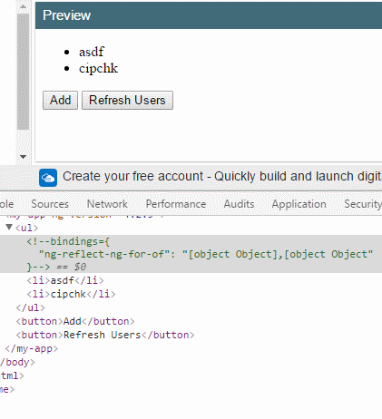

# 数据绑定 ngFor & ngIf

数据绑定指是利用 `{{}}` 包裹着组件类属性名，且支持JavaScript运算，官网名曰：~~插值表达式~~。

哎，其实压根就不应该有种这概念，因为你想呀，把组件类的属性放在模板的某个位置，总归需要一定的语法表述，这是理所当然的事情。

好了，我们不管概念问题了。

## 表达式

数据绑定支持JavaScript运算，这也是理所当然的，组件类提供的属性是一个 `boolean` 的话，为了体验我们总归需要转换成笑或哭吧。

```html
{{ love ? '^_^' : '~_~' }}
```

可是，这种方式也会有极限，比如交易状态码与状态中文的转换，状态码可能多达五六种，让你再写三目运算符会奔溃了吧。

所以，就是有一个叫**Pipe**管道的东西，当然现在我不讲，见[Pipe管道](component/pipe.md)章节。

**输出HTML**

很多时候为了美化可能希望输出一段HTML代码，比如：

```html
{{ love ? '<strong>^_^</strong>' : '~_~' }}
```

可是并不我们所想的一样，直接输出一个加粗的 ^_^，这是因为 Angular 从安全的角度，会对数据绑定的输出代码进行无害化处理，就是对一些可能会引起XSS进行编码化。

因此，对于输出HTML需要利用一个 `innerHTML` 指令（是不是觉得这个名称好熟悉，没错，它就是HTML DOM的 **innerHTML** 属性，你会发现Angular就应该是一种单纯的思维去编码，你会发现原来很爽），而 **innerHTML** 对于现流行浏览器有一定的保护作用，当然这是另一个话题了。

```html
<div [innerHTML]="love ? '<strong>^_^</strong>' : '~_~'"></div>
```

此时，这里少了 `{{}}`` 这是[模板语法](template.md)的事情，现在你暂时先不管这个问题。

至此，现在组件类的属性一直都是一个基础类型（诸如：`string`、`boolean`），这些类型本身是JavaScript支持的，所以表达式理所当然的使用。

可，如果是数组呢？

## *ngFor

假设组件类提供一组用户清单数据。

```typescript
users1: Array<string> = [ 'asdf', 'cipchk' ];
users2: Array<string> = [ { name: 'asdf' }, { name: 'cipchk' } ];
```

那如何在模板中在迭代数组呢？如果按表达式方式需要创建一个Pipe通道来帮你生成一个DOM结构@#￥%……&*，干不下去了，WOC太复杂了。

因此，Angular提供一个很爽的语法糖 `*ngFor`。

```html
user1:
<ul>
    <li *ngFor="let name of users1">{{name}}</li>
</ul>
user2:
<ul>
    <li *ngFor="let item of users2">{{item.name}}</li>
</ul>
```

**for of**

`let ... of` 是ES循环语法 `for of`，作为遍历所有数据结构的统一的方法。所以，这里只能用这种结构。

### 迭代属性

捕获迭代过程中的 `index`、`count` 等，有时候还是非常有用的。

```html
<ul>
    <li *ngFor="let name of users1; let i = index; let c = count;">{{i + 1}}: {{name}}</li>
</ul>
```

迭代属性共包括：

 - `index: number`：当前索引号
 - `first: boolean`：是否第一次
 - `last: boolean`：是否最后一次
 - `even: boolean`：是否偶数
 - `odd: boolean`：是否奇数

不同迭代属性间用逗号隔开，这当然是理所当然，JavaScript本来就是以此为代表一行语句的结束。

 ### `async` 异步

上面数据都是组件类提供的静态数据，如果是一个异步数据呢？

> 很多时候我们的数据是来自Http请求，而数据请求都是通过 Objservable，这一点可以阅读[Http](../http/README.md)章节，这里不做深入。

**如果使用**

只需要加利用 `async` Pipe管道，会自动订阅结果，并会在不必要的时候自动销毁订阅。

```typescript
import { Component } from '@angular/core';
import { Observable } from 'rxjs/Observable';
import 'rxjs/add/observable/of';

@Component({
  selector: 'app-root',
  template: `
    <ul>
        <li *ngFor="let name of users | async">{{name}}</li>
    </ul>
  `
})
export class AppComponent {
  users: Observable<string[]>;

  ngOnInit() {
    this.users = Observable.of([ 'cipchk', 'asdf' ]);
  }
}
```

也许此时，你会较难于理解这一点，所以有关这一点，我建议在你阅读[Http](../http/README.md)章节后，再回过来来看。

### `trackBy` 性能优化

这里前提是当我们需要渲染一个比较大的数组时，可能会需要用到，绝大多数Angular能轻松常见场景的渲染问题。

但保不准像一个比较大的数组或对体验的极致需求，那么就需要渲染层面的优化。下面，我单纯只技术层面去讲 `trackBy` 的作用。

数据总是在变的，这点我们都同意，而数据变了以后自然渲染也会跟着变，因为Angular在检测某个对象的变更时是无法知道哪些项目修改、删除或新增了一个项目。

因此，只好删除所有DOM，然后重新渲染。所以对于大数据而言这种渲染成本非常高。

而 `trackBy` 会按指定的唯一标识符值，从而Angular才能对数据进行判断，这样DOM渲染时就能知道哪些值变更了，从而只需要重新渲染变更的DOM就行。

下面是一个用户列表渲染，`add` 新增一个用户，`refresh` 刷新所有用户。

```typescript
@Component({
  selector: 'my-app',
  template: `
    <ul>
        <li *ngFor="let item of users; trackBy: trackByFn">{{item.name}}</li>
    </ul>
    <button (click)="add()">Add</button>
    <button (click)="refresh()">Refresh Users</button>
  `,
})
export class App {

  users: any[];

  ngOnInit() {
    this.refresh();
  }
  
  refresh() {
    this.users = [ { id: 1, name: 'asdf' }, { id: 2, name: 'cipchk' } ];
  }

  add() {
    this.users.push({ id: this.users.length, name: 'new user' });
  }
  
  trackByFn(index, item) {
    return index; // or item.id
  }
}
```

假如把 `trackBy: trackByFn` 拿掉，你会看到，当我刷新时所有DOM元素会重新渲染。



反之，下标0和1的两个项目（因为这里是使用 `index` 下标作为唯一标识符）都不会重新渲染。


你看从开发者的角度来讲，只需要简单的操作可以就能达到优化的效果。

## *ngIf

很多时候需要部分显示的情况下，比如上面示例，当 `user.id===1` 的时候才显示【管理员】字样，就可能使用 `*ngIf`。

```html
<ul>
  <li *ngFor="let item of users; let i = index;">
    {{i + 1}}: {{item.name}}
    <strong *ngIf="item.id === 1">管理员</strong>
  </li>
</ul>
```

**性能**

`*ngIf` 内所有组件、指令都不需要被创建和变化检测，这是一个非常重要的可优化的信息点。

## *ngFor & *ngIf

无意中总是会写了这样的代码：

```html
<li *ngIf="showUsers" *ngFor="let item of users">{{item.name}}</li>
```

然后收到一个懵逼的异常：

```
Error: (SystemJS) Error: Template parse errors:
	Can't have multiple template bindings on one element. Use only one attribute named 'template' or prefixed with * ("
```

这是因为Angular不支持在一个元素里有多个结构指令，我会在[结构指令](structural.md)详细说明。为了完整度，这里只简单给出答案。

```html
<ng-container *ngIf="showUsers">
  <li *ngFor="let item of users">{{item.name}}</li>
</ng-container>
```