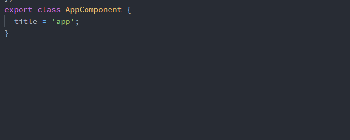
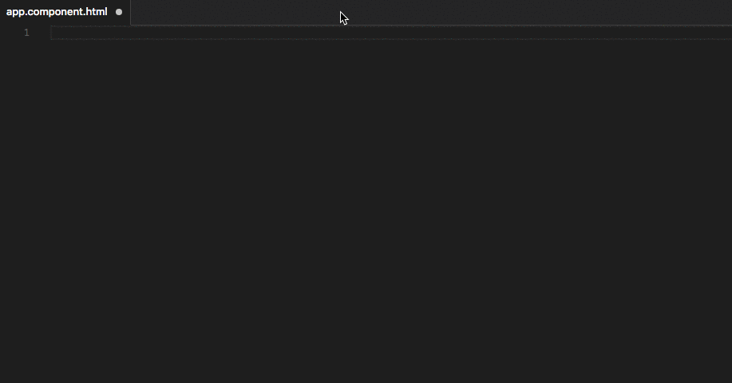
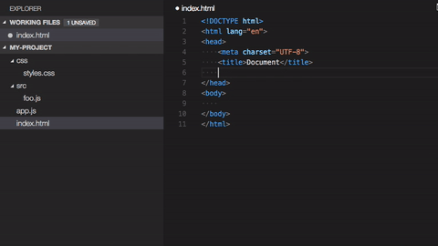
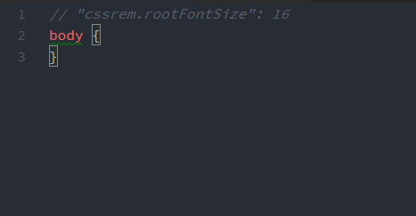

# IDE - Visual Studio Code

如果说Angular Cli是矛，那Visual Studio Code（简称：vscode）就是盾。

在没有TypeScript（简称：ts）的情况下，不管是 vscode、sublime、atom 本质上没有什么区别，而正因Angular首选语言是ts这样就有很多空间。

## TS与ES的区别

ts 与 es 最大的区别在我看来应该是前者编译型、后者是解释性，而这一点对于IDE而言有着天差地别。解释性与编译型最大差异在于类型推断，形成的类型提前检测。

## vscode

你可以从[官网下载](https://code.visualstudio.com/) Windows、MacOS、Linux 不同平台的版本，你可以直接打开 `ng new` 构建生效的项目，长这样：


随便打开一个 *.ts 文件，可以进行一种爽到爆的编码体验。



**.editorconfig文件**

EditorConfig 是一套用于统一代码工具的解决方案，所以默认会帮我们生成该文件，你可以在 `./.editorconfig` 改变成你希望的代码风格。

## 如何优雅调试Angular

Chrome Dev Tools 绝对是目前最爽的 JavaScript 调试工具之一，一方面可以通过在代码 `debugger` 或 直接在 Sources 中添加断点，并且可以直接进入 ts 源代码，真的无可挑剔。

然……

一般在开发Angular，首先需要在CMD终端 （或VSCODE TERMINAL）启动 `ng serve`，后打开浏览器，然后打开 Dev Tools，进入断点，此时再回过头VS CODE修改代码；而其实在开发过程中需要一直重复以下流程：

修改代码 > 打开Dev Tools > 设置断点 > 调试 > 回到VSCODE

当定位到错误总是需要一直在 Chrome 与 VSCODE 切换。

其实……

可以简化这一过程，只需要把调试在VSCODE里面完成，这样当定位错误的时候可以直接修改代码。

### 怎么做？

**1、安装 Debugger for Chrome**

直接在市场中找就行了。

**2、创建 launch.json**

在项目根目录下创建 `.vscode/launch.json`，内容如下：

```javascript
{
    // Use IntelliSense to learn about possible Node.js debug attributes.
    // Hover to view descriptions of existing attributes.
    // For more information, visit: https://go.microsoft.com/fwlink/?linkid=830387
    "version": "0.2.0",
    "configurations": [
        {
            "type": "chrome",
            "request": "launch",
            "name": "Launch Chrome with ng serve",
            "url": "http://localhost:4200",
            "webRoot": "${workspaceRoot}"
        }
    ]
}
```

并没有什么特别是的，只需要注意 `url` 添加项目浏览地址即可。

**3、启动 `ng serve`**

当然这里最好是在 VSCODE TERMINAL 启动 `ng serve` 了。

**4、调试**

在VSCODE按F5进入调试状态，最后打开 Chrome 刷新页面，会直接在 VSCODE 进入断点。

## 插件附录

我们可以给 vscode 加点插件，这样写代码更爽。

### Angular v4 TypeScript Snippets


### Auto Import


### Angular Language Service

绝大多数组件都包括模板与组件类，而如果能将模板与组件进行关联，是不是太爽了。



### Path Intellisense

当需要 `import` 文件路径时非常方便。



### cssrem

一个CSS值转REM的VSCode插件，谁叫我是能吃呢？



以上，这些插件是我每天都离不开的，如果你有更好插件，欢迎告知！